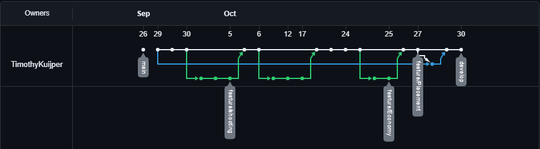

# DRY AND SRP

Dit is het script dat aan een tower wordt gehangen voor het schieten van een pijl. Dit is SRP en DRY omdat de pijl als prefab in de inspector wordt geassigned en er voor de vershilende kaliber pijl geen extra code is geschreven.

[Shooting script](WatchtowerWarriors\Assets\Scripts\Tower\Shooting\Shoot.cs)

# ROOT

Dit is de [ROOT](WatchtowerWarriors) van mijn unity project.

# RELEASE

Dit is de [release](https://github.com/TimothyKuijper/BOM5TowerDefense/releases) van mijn project.

# SPRITES AND TEXTURES

Sorry maar dit werkt niet door git gezeik 

# ISSUES IN GITHUB

Ik heb hier niks voor te laten zien omdat ik niet tijden het maken van mijn bo opdracht aan deze readme heb gewerkt en nu al klaar ben dus geen bugs meer heb.

# GAME DESIGN MET ONDERBOUWING

Ik ben niet vant voren bezig geweest met het idee van de game en ben gewoon aan de slag gegaan

# CLASS DIAGRAMS

Aangezien mijn project uit 28 scripts bestaat en als spagheti door elkaar heen hangen heb ik na 3 uur proberen er iets van te maken dit opgegeven

# 8 - 9 

Ook hier kan ik niks voor laten zien omdat niet tijdens het maken van mijn game of een prototype heb gemaakt en ook totaal scrum over het hoofd heb gezien

# GITFLOW 

